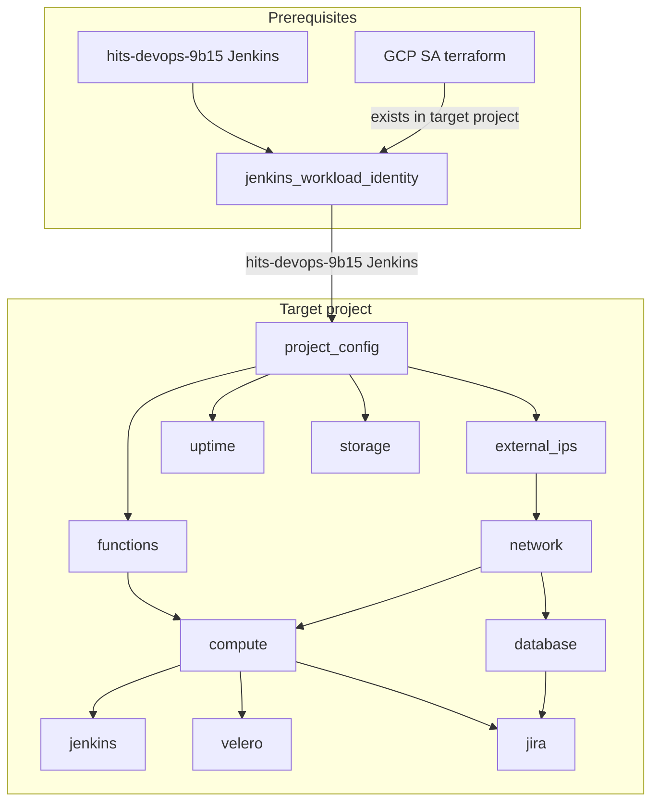

# Google Cloud Platform Infrastructure as Code

###### This feels good

### Repository Structure

This repository follows a monolthic module structure where each module is an application or product group to manage.
Further documentation is published here: https://git.umms.med.umich.edu/devops/gcp-iac/-/tree/master/docs

### Branches and Merge Requests

Are a requirement for working in this repository! All development should be done in branches, and be delievered with valid testing and pipelines available.

# Initial Project Creation

## Requirements

* [gcloud sdk/tools](https://cloud.google.com/sdk/install) binary installed and authenticated.
* Terraform 0.14.10 
* [This code uses a requirements file](https://galaxy.ansible.com/docs/using/installing.html); install necessary requirements:

```bash
pip3 install google-cloud-storage
ansible-galaxy install --force --roles-path ./roles -r roles/requirements.yml
ansible-galaxy collection install -p ./collections --force -r roles/requirements.yml
export ANSIBLE_COLLECTIONS_PATHS=./collections
```

## Initial Project Config

* Be sure that you are [authenticated with gcloud](https://cloud.google.com/sdk/docs/authorizing) with an account with `Owner` permissions
* Create your project (currently a ticket to ITS) and enable it with gcloud

### Create Ansible vars/vault for the GCP Project
* Ensure you understand The [Concepts](docs/Concepts/README.md) document around `Customer Product Configuration`
* Create or edit the project variables
  * The location in this repository is `customer_products/{{ customer }}/{{ product_instance }}/{{ project_id }}` with a `vars.yml` and `vault.yml` for normal variables and sensitive variables, respectively.
  
* At a minimum, you will want something like the following for vars.yml:

```yaml
project_vars:
  # the project id as assigned by ITS
  project_id: hits-devops-id-randostring
  # data sensitivity rating of the project
  project_data_sensitivity: "low"
  # The Mcommunity group (minus the @umich.edu) or uniqname
  project_technical_owner: "hits-software-delivery-development-services"
  # The Mcommunity group (minus the @umich.edu) or uniqname
  project_business_owner: "hits-software-delivery-development-services"
  # A reference that is used to label various configuration
  project_configuration_item: "tools"
  # Any additional Google labels
  additional_labels: {}

product_instance_config:
  gcp_product:
    # Corresponds to the `products/{{ product_name }}.yml` file
    name: "gke-default"
    version: beta

# The place to store the terraform and backups
gcp_terraform_bucket_project: "hits-devops-backups-03e3"

# the default location of all created resources/objects
project_location:
  region: us-central1
  zone: us-central1-a

# The default HA location of all created resources/objects
project_backup_location:
  region: us-east1
  zone: us-east1-a

# A place to override each terraform_app's default
custom_overrides: {}
```
* Note that the vault.yml will need some variables as well:

```
FIXME
```
### Bootstrap the project

### Run bootstrap_product_instance locally

* bootstrap_product_instance does the following:
  *  initializes the project with a custom role for terraform
  *  sets up workload identity between the project and the tools project
  *  makes a bucket for the project's terraform code
  *  initializes the `cross_project` terraform app, BUT DOES NOT APPLY that code.

```bash
export ANSIBLE_COLLECTIONS_PATHS=./collections # Ansible >2.10
export CUSTOMER=changeme! # enter the actual customer short-name here
export INSTANCE=changeme! # enter the product instance name here
ansible-playbook bootstrap_product_instance.yml -e project_id=`gcloud config get-value project` -e customer=$CUSTOMER -e product_instance=$INSTANCE --ask-vault-pass
```
* When bootstrap_product_instance is complete:
  * Note the output of the final debug tasks

## Playbooks


## product_vars.yml

This playbook will generate the variables necessary to template out all the terraform_apps in a particular project's product_instance.  By default, these vars are stored in generated_vars file

##### Example
```bash
export ANSIBLE_COLLECTIONS_PATHS=./collections # Ansible >2.10
export CUSTOMER=changeme! # enter the actual customer short-name here
export INSTANCE=changeme! # enter the product instance name here
ansible-playbook product_vars.yml -e project_id=`gcloud config get-value project` -e customer=$CUSTOMER -e product_instance=$INSTANCE --ask-vault-pass
```


* Here's a "simple" dependency graph of the current state:


##### Inputs

| Name              | Description                                                  | Example               |
| ----------------- | ------------------------------------------------------------ | --------------------- |
| project_id        | The name of the GCP project that will be managed             | hits-devops-cicd-8690 |
| customer          | The customer shortname | devops |
| product_instance  | A instantiation of a product | tools |

##### Internal vars (optional)

## deploy-jenkins.yml

##### Requirements

* Gcloud sdk/tools binary installed and authenticated.
* Kubectl access to the cluster you are trying to configure.
* Necessary variables created in `gcp_iac/group_vars/{{ customer }}`

```
gcloud container clusters get-credentials test-hits-atlassian-cluster --zone us-central1-a --project $GOOGLE_CLOUD_PROJECT
```

Note: For now, to pull images from other projects' Container Registries, the default Compute Engine service account needs to be a "Storage Object Viewer" on the "artifacts.${GOOGLE_CLOUD_PROJECT}.appspot.com" Storage bucket in the other project.

##### Example

    ansible-playbook deploy-jenkins.yml -e project_id=`gcloud config get-value project` -e jenkins_env=test --ask-vault-pass

#### Inputs

| Name        | Description                                                  | Example               |
| ----------- | ------------------------------------------------------------ | --------------------- |
| project_id  | The GCP project id                                           | hits-devops-cicd-8690 |
| jenkins_env | Key in jenkins_config, representing production tier of the Jenkins instance, e.g. test/prod | Test                  |

#### Internal vars (required)

| Name                | Description                                                  | Example           |
| ------------------- | ------------------------------------------------------------ | ----------------- |
| customer_ldap_group | The Mcommunity group used to control access to this Jenkins instance, typically provided by the customer. | HITS-ACADEMIC-SWD |

## Post-Terraform Steps

### GCloud-Terrible
If your Jenkins deployment needs access to the GCloud Terrible container:
* Navigate to Your Project --> IAM and locate the "Default Compute Service Account."  Copy it's email address.
* Go to the DevOps container bucket: https://console.cloud.google.com/storage/browser/artifacts.hits-devops-9b15.appspot.com;tab=objects?forceOnBucketsSortingFiltering=false&project=hits-devops-9b15&prefix=&forceOnObjectsSortingFiltering=false
* Navigate to the "Permissions" tab
* Add the email address you copied earlier and assign the "Storage Object Viewer" role

### Bind Disks to Snapshot Policy
This will ensure snapshots are taken of disks on a schedule defined in your vars file
* In DevOps Jenkins, create a bind job for your project based off of this code: https://git.umms.med.umich.edu/devops/gcp-jenkins-pipelines/-/blob/master/bind-disks-to-policy.groovy (updating the config as needed)
* Run the job

### Create Databases and Database IDs
This will create DBs and DB IDs based on your vars.
* In the Jenkins instance in your application cluster, create a job based off of this code: https://git.umms.med.umich.edu/devops/gcp-jenkins-pipelines/-/blob/master/db-schema-rbac.groovy (updating the config as needed)
* Run the job

## Troubleshooting


